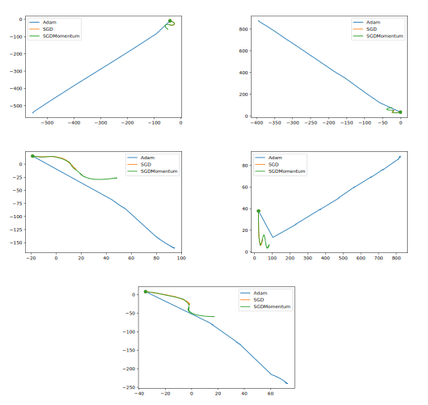

# Comparing Optimization Algorithms
__Which algorithms?__ Adam, SGD, and SGD with momentum.  
__Optimizing what?__ Optimizing the weights of models to be fitted on 2 text and 2 image classification datasets.

## Datasets
### IMDB
A binary sentiment classification text dataset (Mass et al., [2011](https://aclanthology.org/P11-1015)).

### AG News
AG’s news corpus consisting of titles and descriptions (Zhang et al., [2015](https://dblp.org/rec/journals/corr/ZhangZL15)).

### CIFAR-10
An image classification datasets containing RGB photos with the shape of 32x32 (Krizhevsky et al., [2009](https://www.cs.toronto.edu/~kriz/learning-features-2009-TR.pdf)).

### FashionMNIST
An image classification datasets containing B&W photos with the shape of 28x28 (Xiao et al., [2017](http://arxiv.org/abs/1708.07747)). The dataset was created from Zalando’s article images to pose a more difficult task than the MNIST dataset.

## Architectures
### Text Datasets
An embedding layer accepting a sparse input and mapping it to a dense representation of a dimension of 16. The mean of the vectors representing words is used as an input to a fully connected network with one hidden layer with 200 neurons followed by an output layer with C neurons, where C is the number of classes. ReLU is used for all layers as an activation function except the output layer where softmax is used.

### Image Datasets
A CNN network with dropout, maxpool (optional), and batch normalization after every CNN block was designed. The CNN's output was used as an input for a fully connected network consisting of one hidden layer and an output layer. ReLU was used as an activation function for all CNN blocks and hidden layers, softmax was used for the output layer.

## Visualizing The Paths
> If the path be beautiful, let us not ask where it leads.  
> _Anatole France_

In this section the "paths" followed by the model weights during optimization are plotted. This is done as follows:
1. The model weights after each epoch are saved (at the end of the process we get checkpoints $W_0 \ldots W_T$ for $T$ epochs).
2. The saved weights are reduced to 100 dimensions using PCA (Jolliffe, [1986](https://doi.org/10.1007/978-1-4757-1904-8_7)).
3. The transofmred weights (with 100 dimensions) are reduced to two dimensions using TSNE (Maaten et al., [2008](https://www.jmlr.org/papers/volume9/vandermaaten08a/vandermaaten08a.pdf)).

Five optimization processes were run for each model, dataset pair. The inital weights and the order of the data (batches and their content) seen during training are the same for all the optimizers.

The only hyperparameter that was experimented with is the learning rate of the optimizer. The learning rate leading to path with the __minimum__ train loss among the other learning rates was chosen. This process was done for Adam optimizer and later for SGD only for the text datasets. The model trained on IMDB did not converge when using SGD or SGD with momentum.

### IMDB

### AG News

### CIFAR-10

### FashionMNIST

## Comments
 - The superiority of Adam and the positive effect of momentum is evident from the results I got across the datasets. However the process I ran on the image datasets could be further improved w.r.t. SGD hyperparameters (recall that the learning rate was chosen according to the results I got from Adam).

- The paths are more smooth when we add momentum to the optimization process. This is expected as the history of updates applied affect the current values of parameter update. Adam optimizer seems to zigzag in the text datasets when it is supposed to converge. I think that this may be avoided by using a scheduler to decrease the learning rate.

- SGD and SGD with momentum seem to follow a closer path to each other than to Adam.

## Reproduce
To get the results shown here run the codes in the Jupyter notebook `main.ipynb` then visualize the results by running the codes in `visualization.ipynb`.
Some hyperparameters can be changed from `hyperparams.json`.
